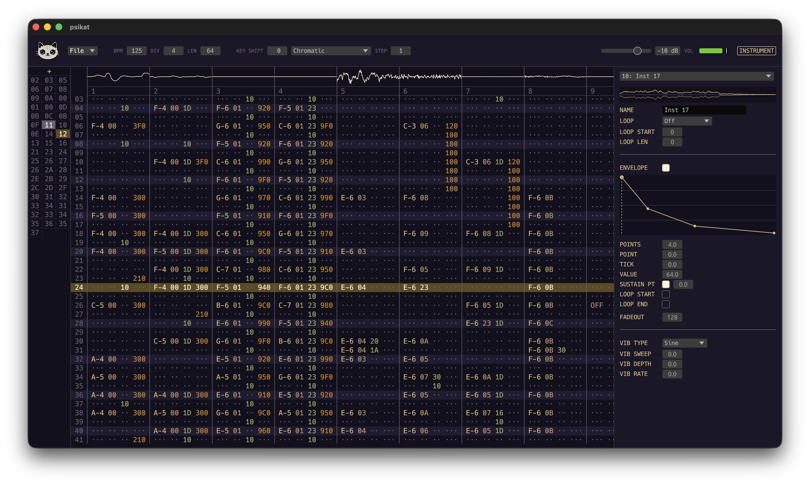

# psikat

A lightweight cross-platform tracker-like sequencer built with Rust and egui.



## 🚧 UNDER DEVELOPMENT 🚧

Each time I sit down to work on this project, I find new things I want to fix, add or change.
Hang tight...this is gonna take a while! It's still missing a lot of features that I would consider to be essential before an official 1.0.0 release, but I keep going on side-missions that unveil alot of new possibilities I didn't even think about.

**Latest changes**

- Allow each track to use different subdivisions = POLYRHYTHMS!!!
- Highly flexible musical subdivision system that doesn't force you to do maths
- Pattern arranger!!!
- BPM, Time signature/subdivison/beat are NOT global but can be set per pattern!
- Time signature/subdivision/beat system
- Added mixer with channel strips
- Polyphonic tracks (up to 8 voices)
- Removed all .xm effect commands in preparation of unique approach

> _All features are subject to change without notice before version 1.0.0_

---

While working with the .xm and .mod formats initially was a great starting point, there are already excellent trackers like [Furnace](https://tildearrow.org/furnace/), [FamiStudio](https://famistudio.org/), [Renoise](https://www.renoise.com/), [OpenMPT](https://openmpt.org/), and [MilkyTracker](https://milkytracker.org/) that handle legacy formats well and are made by people who have deep knowledge of the tracker format and scene.

Coming from a background of music production in horizontally scrolling, clip-based DAWs; I feel like my efforts are better spent building something new instead, that aligns more with my own personal preferences. I just really love the tracker workflow, but some habits are too ingrained in me to let go of and I wanna see if that friction can produce something unique.

## Install

> _If **Releases** is empty, I'm doing some big changes and wiped out the old releases because they no longer represent what psikat is about. New release coming soon! In the meanwhile you can build psikat from source following the instructions below._

Download the latest release for your platform from [**Releases**](https://github.com/holoflash/psikat/releases/latest):

| Platform              | File                         |
| --------------------- | ---------------------------- |
| macOS (Apple Silicon) | `psikat-macos-aarch64.dmg`   |
| macOS (Intel)         | `psikat-macos-x86_64.dmg`    |
| Linux                 | `psikat-linux-x86_64.tar.gz` |
| Windows               | `psikat-windows-x86_64.zip`  |

**macOS:** Open the `.dmg` and drag Psikat to Applications. If macOS says the app "is damaged and can't be opened", run this once in Terminal:

```sh
xattr -cr /Applications/Psikat.app
```

## Build from Source

Requires [Rust](https://rustup.rs/).

**macOS** — creates a `Psikat.app` bundle (requires Python + Pillow for icon generation):

```sh
./scripts/bundle_macos.sh
open target/Psikat.app
```

**Linux** — requires ALSA and X11/Wayland dev libraries:

```sh
sudo apt install libasound2-dev libgl1-mesa-dev libxkbcommon-dev libwayland-dev
./scripts/build_linux.sh
```

**Windows:**

```bat
scripts\build_windows.bat
```

## License

MIT
